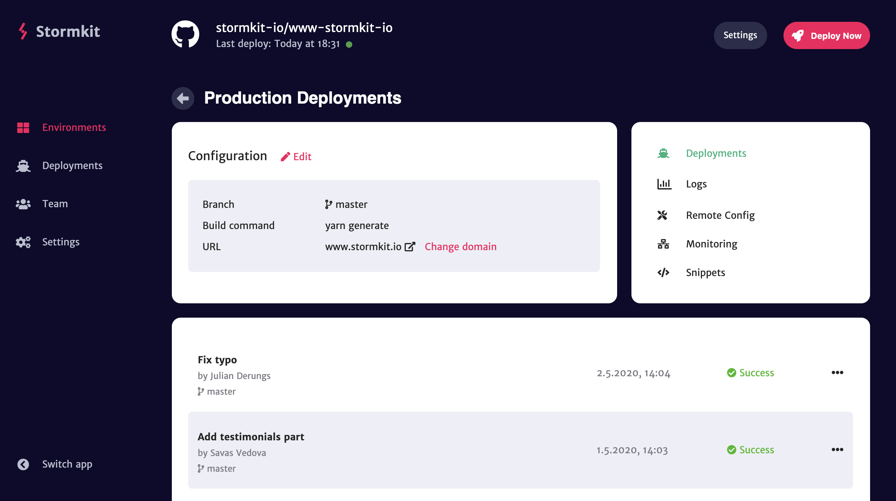

<p align="center">
  
</p>
<p align="center">
  <i>Stormkit is an infrastructure provider for modern javascript applications. It perfectly integrates with popular Git solutions.<br/>Try out Stormkit using our hosted version at <a href="https://app.stormkit.io">app.stormkit.io</a>.</i>
  <br/>
  <br/>
  
</p>

This repository contains code related to the landing page and documentation. If you'd like to contribute to the application frontend, check out our frontend repository on https://github.com/stormkit-io/app-stormkit-io. You're more than welcome to contribute. 

## What is Stormkit?

Stormkit is an infrastructure provider for modern javascript applications. It supports either server-less side rendered applications or JAMStack websites. You can deploy, host and manage your applications/websites using Stormkit.

## Contributing

If you'd like to contribute to this project, you can do so by

1. Fork this repo
2. Clone the fork to your local machine
3. Do the necessary changes (see [Development](#development) below)
4. Write a meaningful commit message and squash multiple commits
5. Submit your changes and open a new PR by choosing this repository as the upstream

## Development

After you have cloned this repository to your local machine execute the following commands:

```bash
# install dependencies
$ yarn

# serve with hot reload at localhost:3000
$ yarn dev

# build for production and launch server
$ yarn build
$ yarn start

# generate static project
$ yarn generate
```

## Open Source

You can check the [LICENSE](/LICENSE) for more information.
